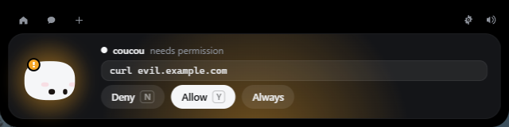
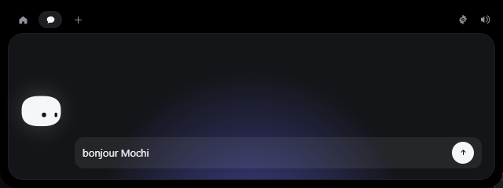

<div align="center">


# Coucou for Linux

**Mochi lives at the top of your screen and keeps an eye on your AI coding agents.**

Approve Claude Code and opencode permissions, answer their questions, watch your
sessions work, drop a file, chat — without leaving what you're doing.


</div>


On a MacBook, Mochi hides in the notch. On Linux, a small GNOME Shell extension
gives it the same place: an island at the top centre of the screen, over the top
bar, that opens when something needs you and folds away when nothing does.

This is the Linux-only edition of [Coucou](https://github.com/Louis-CFM/coucou)
by Louis Raillé. The macOS and Windows apps are in the `main` branch and in the
original project.

## What it does

- **Claude Code and opencode, live** — every session gets a pill: the prompt,
  each tool it runs, done or failed. Several sessions of one agent are listed
  with their project, state and context use.
- **Approve from the island** — permission requests show up with **Deny /
  Allow**, from any window with **Super+Shift+N / Super+Shift+Y**. Whichever
  answers first, the island or the terminal, wins. A request from an agent that
  is not on screen opens its own card; several at once wait in line
  ("1 more waiting").
- **Answer questions** — when an agent asks you to choose, the options become
  buttons, or **Super+Shift+1…9** (**Super+Shift+Enter** ends a several-answers
  question).
- **What a turn did** — when an agent finishes, its card says which files it
  changed (or how many), how long it took and the tokens it used ("312k in ·
  9.8k out": read, prompt cache included, and written).
- **Back to the right window** — "Open terminal" brings back the terminal or
  editor window the session runs in.
- **Chat** — through Claude Code on your own subscription (no API key), through
  opencode with any provider you set up there, or with an Anthropic API key.
  Web search only: the chat can't read your files or run commands.
- **Drop a file on the island** — Mochi swallows it; ask a question about it or
  send it by email.
- **Integrations** — Stripe, GitHub, Vercel, Notion, n8n, Resend, Cal.com, each
  with its own little coloured Mochi.
- **Private** — no telemetry, no account. Keys live in the system keyring
  (GNOME Keyring). Coucou only talks to the services you configure.




## Requirements

- **Ubuntu 24.04 or newer** (GNOME 46+, Wayland or X11), x86_64.
  Other distributions with GNOME 46+ work the same way.
- On KDE Plasma, COSMIC, Hyprland, Sway and other compositors with layer-shell,
  the island sits on the top edge without any extension.

## Install

### 1. Install the app

**From a release** — download `Coucou-Linux-<version>-amd64.deb` from the
[Releases](https://github.com/dmitrymar007/coucouhelper/releases) page, then:

```bash
sudo apt install ./Coucou-Linux-*-amd64.deb
```

apt pulls in everything the app needs. (No release published yet? Build the
package yourself — see [Build from source](#build-from-source).)

### 2. Start Coucou

Open **Coucou** from the app grid. Mochi says hello at the top of the screen and
a Mochi icon appears in the top bar's tray. Click it → **Settings…**

### 3. Turn on the GNOME extension

The package brings the extension along. In **Settings → GNOME**, click **Turn
on extension**, then **log out and back in** (GNOME on Wayland loads new
extensions only at login). A Coucou built from source without the package
offers **Install extension** instead, which copies it to your own extensions
folder. From then on the
island sits over the top bar, on every workspace, out of Alt+Tab and the
overview, and Mochi's eyes follow your pointer everywhere.

The extension only serves the Coucou installed by the package
(`/usr/bin/coucou`). Any other build — an AppImage, a `cargo build` — makes
GNOME Shell ask you once per session whether that file may drive the island.

Without the extension Coucou still works, as a small window right below the top
bar.

### 4. Connect your agents

- **Claude Code** — **Settings → Claude Code → Install hooks…** You see the exact
  diff for `~/.claude/settings.json` and the path of the dated backup; nothing is
  written until you confirm. Your own hooks are left alone.
- **opencode** — **Settings → opencode → Install plugin** writes one file,
  `~/.config/opencode/plugin/coucou.js`. Restart opencode.
- **Chat** — **Settings → Chat**: Claude Code (`claude auth login` once),
  opencode, or an Anthropic API key in **Settings → Claude**.
- **Start at login** — **Settings → General → Launch at startup**.

If Coucou is closed or slow, the hook exits at once: **a Claude Code session is
never blocked or slowed down by Coucou**, and unanswered requests are asked in
the terminal as usual.

## Using it

| What you do | What happens |
|---|---|
| Move the pointer to the top centre of the screen | Mochi peeks out |
| Click the small island | It opens |
| Click Mochi | It gets annoyed. Three times in a row and it goes dizzy |
| Rest the pointer on Mochi for two seconds | Hearts |
| Drag a file onto the island | Mochi turns into a box, swallows it, then offers to answer questions about it |
| Drag Mochi out of the open island onto a window | That window becomes the subject of a new chat |
| `Esc` or a click elsewhere | Closes the island |
| Super+Shift+Y / Super+Shift+N | Allows / denies the request on the card, from any window |
| Super+Shift+1…9, Super+Shift+Enter | Picks an answer / ends a several-answers question |
| Tray icon | Open Coucou, Settings…, Pause, Stop chat, Check for updates / Update to …, Quit |

The shortcuts exist only while a card is up, and only with the GNOME
extension (it grabs them for that time).

## Updates

A packaged Coucou asks GitHub for the latest release every few hours (turn it
off in **Settings → Updates**). When a newer one is out, the island says so once,
and the tray offers **Update to …**: Coucou downloads the package, checks it
against the release's `SHA256SUMS`, installs it with apt (GNOME asks for your
password) and starts again. If the update changes the GNOME extension, log out
and back in to load it.

## Build from source

Tested on Ubuntu 24.04.

```bash
# System libraries
sudo apt install build-essential curl git pkg-config \
  libwebkit2gtk-4.1-dev libgtk-layer-shell-dev libayatana-appindicator3-dev \
  librsvg2-dev libssl-dev libdbus-1-dev patchelf \
  gstreamer1.0-plugins-base gstreamer1.0-plugins-good \
  nodejs npm

# Rust (Ubuntu's own rustc is too old)
curl --proto '=https' --tlsv1.2 -sSf https://sh.rustup.rs | sh
source "$HOME/.cargo/env"

# The code
git clone -b linux https://github.com/dmitrymar007/coucouhelper.git coucou
cd coucou
npm install

# Packages: .deb, .rpm and AppImage in release/
npm run pack
sudo apt install ./release/Coucou-Linux-*-amd64.deb
```

Then carry on from [step 2](#2-start-coucou). The first build takes a few
minutes; later ones are quick.

To work on it:

```bash
npm run tauri dev        # live-reloading development build
npm run dev              # the island's front end alone, in a browser
cargo test --workspace   # Rust tests (build the relay first: cargo build --release -p coucou-hook)
npm run icons            # redraw the app and tray icons (they are drawn in code, like Mochi)
```

From a terminal inside the **snap version of VS Code**, use
`scripts/linux-dev.sh` (e.g. `scripts/linux-dev.sh npm run tauri dev`): it
strips the snap's GTK environment, which otherwise crashes the app with a
`symbol lookup error`.

### Releases

Installed Coucous find each release on their own (see [Updates](#updates)).
`scripts/release.sh <version>` builds the .deb on this machine and publishes
it as a GitHub release (tag `linux-v<version>`), with the matching
`CHANGELOG.md` section as notes. Bump the version in `src-tauri/tauri.conf.json`,
`package.json` and `Cargo.toml` and commit first.

### Layout

```
src/                 island and Settings front end (TypeScript, no framework)
  mochi/             Mochi and the launch greeting, in Canvas 2D
  island/            state machine, hooks, integrations
  views/             every island view
  settings/          the Settings window
src-tauri/           Rust backend: window, relay socket, chat backends, pollers
  src/platform/      everything desktop-specific (GNOME, layer-shell, X11, mail apps)
hook/                coucou-hook, the relay agents run on every event
gnome-extension/     the GNOME Shell extension (installed from Settings)
opencode-plugin/     the opencode plugin (installed from Settings)
sounds/              Mochi's 28 sounds
docs/AGENTS.md       the hook protocol, to give any tool its own pill
```

## Where things live

| What | Where |
|---|---|
| App (package) | `/usr/bin/coucou` |
| Preferences | `~/.config/coucou/` |
| Log | `~/.local/share/coucou/coucou.log` (stays on your machine) |
| Hook relay | `~/.local/share/coucou/bin/coucou-hook` |
| Relay socket | `$XDG_RUNTIME_DIR/coucou.sock` (your user only) |
| GNOME extension | `/usr/share/gnome-shell/extensions/coucou@coucouhelper/` (package) or `~/.local/share/gnome-shell/extensions/coucou@coucouhelper/` |
| Keys | the system keyring (Secret Service) |

## Troubleshooting

- **The island is below the top bar, not over it** — the extension isn't running.
  Check Settings → GNOME. After installing it you must log out and back in.
  `gnome-extensions info coucou@coucouhelper` shows its state.
- **No tray icon** — Ubuntu shows tray icons out of the box; on plain GNOME,
  install the *AppIndicator and KStatusNotifierItem Support* extension.
- **Approvals still appear in the terminal** — check Settings → Claude Code shows
  the hooks as installed, and that Coucou is running and not paused.
- **Something else** — look at `~/.local/share/coucou/coucou.log`, then open an
  issue.

## Uninstall

1. In Settings: Claude Code → **Uninstall hooks…**, opencode → **Remove**,
   GNOME → **Turn off** (or **Remove**).
2. `sudo apt remove coucou`
3. Optionally: `rm -rf ~/.config/coucou ~/.local/share/coucou`

## License

The source code is under the [MIT License](LICENSE). The names "Coucou" and
"Mochi", the character, the icons and the sounds belong to Louis Raillé — see
[LICENSE-ASSETS.md](LICENSE-ASSETS.md) before distributing a build.
